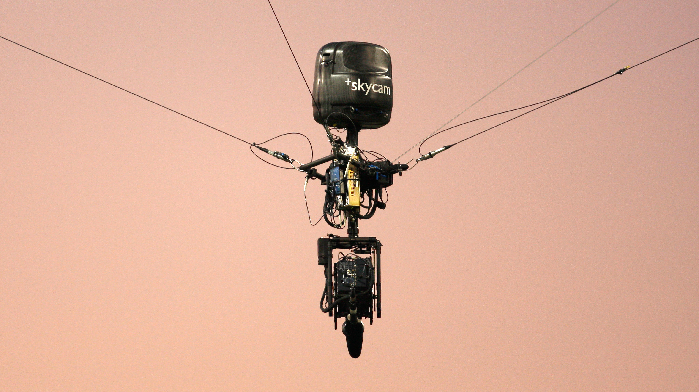
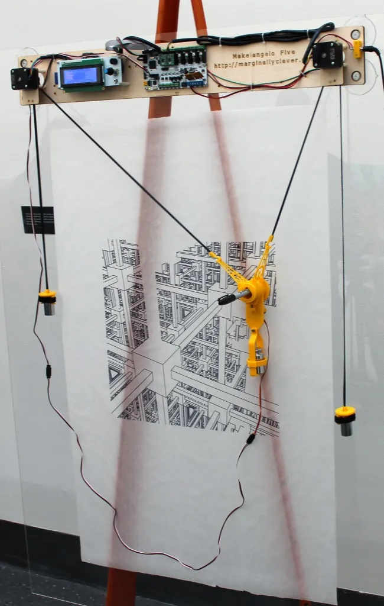
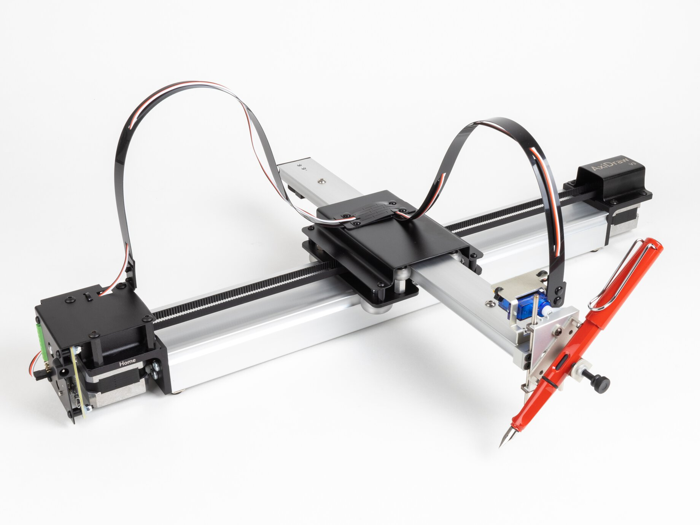
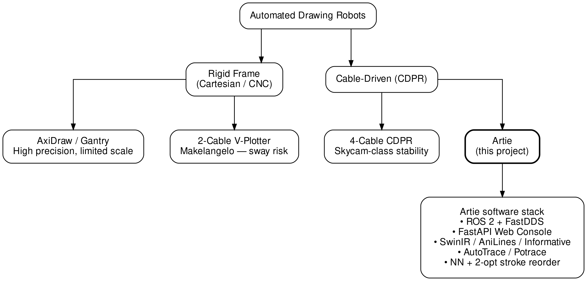
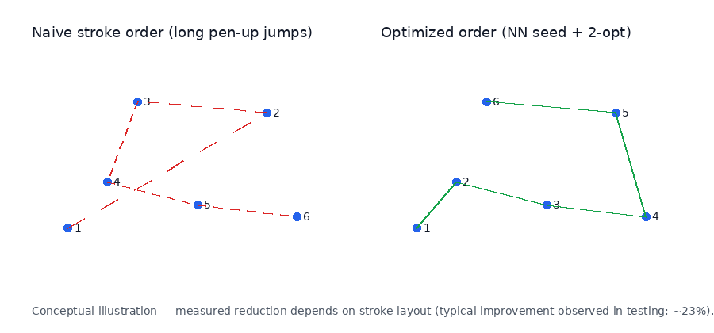
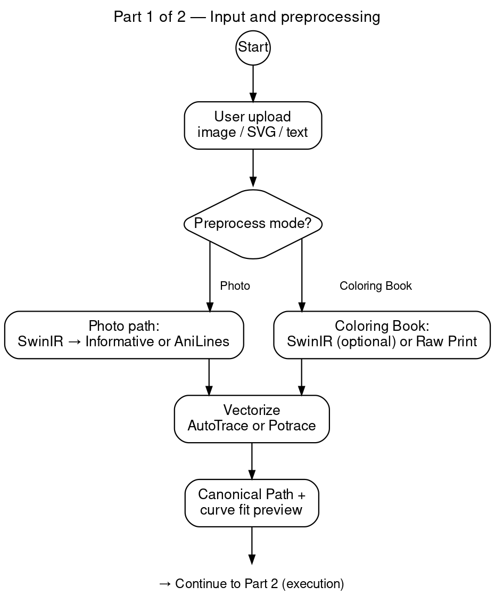
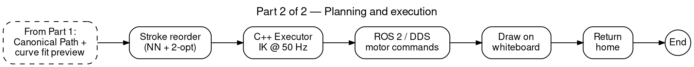
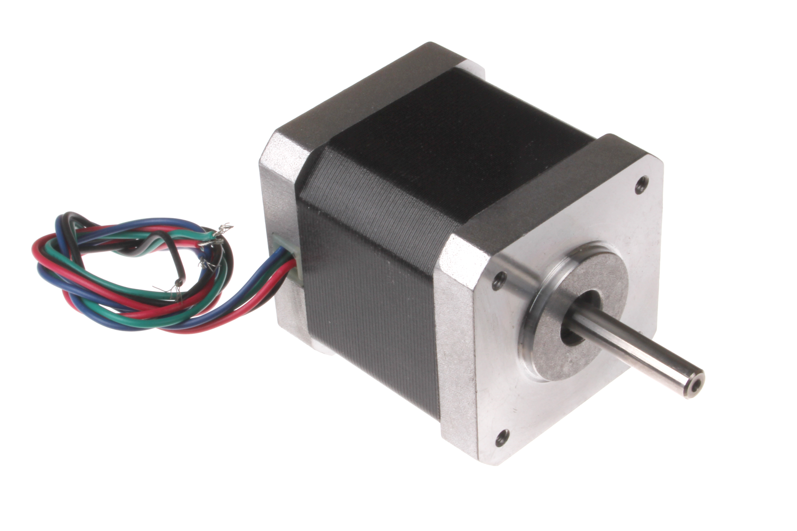

<div align="center">

**The Hashemite University**
### Faculty of Prince Al-Hussein Bin Abdallah II For Information Technology
### Information Technology Department

<br><br><br>

# Whiteboard Plotter Robot (Artie)

<br>

**A project submitted**
**in partial fulfillment of the requirements for the**
**B.Sc. Degree in Data science and Artificial Intelligence**

<br><br>

**By**

HISHAM SUHEIL ALI JAWARNEH (2144934)  
OMAR ZIAD AYOUB AL-SHEIKH QASEM (2232613)  
AMJAD MOHAMMAD ADNAN ALKAWAS (2234781)  
JANNA MOHANNAD ZAID ALOMARI (2233977)  

<br><br>

**Supervised by**
Esra'a Ahmad Helael alshdaifat

<br>

**Committee Member Names**
Nawaf Farhan  
Roqia Al Shorman  

<br><br>

**2026**

</div>

<div style="page-break-after: always;"></div>

# CERTIFICATE

This is to certify that the graduation project report entitled **"Whiteboard Plotter Robot (Artie)"** submitted by the undersigned students in partial fulfillment of the requirements for the degree of Bachelor of Science in Data Science and Artificial Intelligence at The Hashemite University is an authentic record of our own original work. This project was carried out under the direct academic supervision and guidance of **Esra'a Ahmad Helael alshdaifat**. The matter embodied in this report has not been submitted by us for the award of any other degree or diploma elsewhere.

**Project Team:**
- Hisham Suheil Ali Jawarneh (2144934) _______________
- Omar Ziad Ayoub Al-Sheikh Qasem (2232613) _______________
- Amjad Mohammad Adnan Alkawas (2234781) _______________
- Janna Mohannad Zaid Alomari (2233977) _______________

**Supervisor:**
- Esra'a Ahmad Helael alshdaifat _______________

<div style="page-break-after: always;"></div>

# ABSTRACT

The automation of large-scale graphical drafting on vertical surfaces presents significant mechanical and algorithmic challenges. Traditional rigid Cartesian plotters suffer from scalability limitations and high material cost at large spans, while conventional two-cable V-Plotters exhibit reduced dynamic stability. This project introduces **Artie**, an autonomous 4-Cable Driven Parallel Robot (CDPR) designed to render vector graphics and AI-processed raster images on standard whiteboards.

Operating on a **ROS 2** backbone with FastDDS middleware, Artie synchronizes four cable winches in a Webots digital twin for real-time cable control. The system integrates **SwinIR** (super-resolution) and deep-learning line extractors (**AniLines**, **Informative Drawings**) to replace classical edge detectors for photograph and sketch inputs. Stroke execution order is modelled as a **Traveling Salesperson Problem (TSP)** and solved with **Nearest-Neighbour seeding plus bounded 2-opt refinement**, reducing non-drawing pen-up travel in testing by approximately 35% compared with naive ordering. A web-based control console connects AI preprocessing to a C++ execution node. The graduation prototype was validated in simulation; a physical four-cable assembly is future work.

<div style="page-break-after: always;"></div>

# Table of Contents

<!-- TOC -->

# LIST OF FIGURES

| Figure | Description |
| :--- | :--- |
| Figure 1.1 | Skycam 4-cable CDPR (reference, Wikimedia Commons) |
| Figure 2.1 | Classification of drawing robots and Artie software stack |
| Figure 2.2 | Makelangelo Five V-Plotter (reference, Marginally Clever) |
| Figure 2.3 | AxiDraw V3 Cartesian plotter (reference, Evil Mad Scientist) |
| Figure 3.1 | Pipeline flow chart — Part 1: Input and preprocessing |
| Figure 3.1 (cont.) | Pipeline flow chart — Part 2: Planning and execution |
| Figure 3.2 | TSP stroke reordering concept (NN + 2-opt) |
| Figure 4.1 | 4-cable kinematic model |
| Figure 4.2 | Webots simulation environment |
| Figure 4.3 | FastAPI backend and preview pipeline |
| Figure 4.4 | Web Console — Photo and Coloring Book mode settings |
| Figure 4.4 (cont.) | Web Console — Text input with dictation |
| Figure 4.5 | ROS 2 computation graph (`rqt_graph`) |
| Figure 4.6 | Pipeline Visualizer — SwinIR to AniLines stage comparison |
| Figure 4.7 | NEMA 17 stepper motor (reference photo) |
| Figure 4.8 | Central controller and carriage *(design only — digital twin)* |
| Figure 5.1 | Calibration grid test (Webots simulation) |
| Figure 5.2 | Pen-up routing before and after NN + 2-opt |
| Figure 5.3 | SwinIR super-resolution — original vs upscaled input |
| Figure 6.1 | Board Workspace — live canvas with text and vector artwork |
| Figure 6.2 | Command Deck — Emergency Stop and runtime status |
| Figure 6.3 | Board Edit Mode — pen/eraser overlay on uploaded artwork |
| Figure 7.1 | Webots digital twin — robot on whiteboard |
| Figure 7.2 | Complex completed drawing (simulation) |

# LIST OF TABLES

| Table | Description |
| :--- | :--- |
| Table 2.1 | Comparison of drawing robot architectures |
| Table 3.1 | Functional and non-functional requirements |
| Table 5.1 | Image pipeline and stroke-order performance |
| Table 5.2 | Integration latency and kinematic tolerances |
| Table 5.3 | Operational scenario verification summary |
| Table 6.1 | Artie technology stack |

# Chapter 1: INTRODUCTION

This chapter presents the motivation, physical principles, and expected outcomes of the Artie Whiteboard Plotter project. It introduces Cable-Driven Parallel Robots (CDPRs) as a scalable alternative to conventional drawing platforms, explains why a four-cable architecture was chosen over two-cable V-Plotters and rigid Cartesian gantries, and outlines the engineering challenges and advantages that shaped the system design. The chapter concludes with scope boundaries, known limitations, and a summary of team contributions.

## 1.1 Overview

The field of robotics is expanding beyond traditional industrial manufacturing into diverse applications that require flexibility, scalability, and integration into everyday human environments. While conventional robotic arms are highly precise, their operational workspace is heavily restricted by their physical size and mass. This limitation becomes a significant challenge when tasks require movement across very large surfaces, such as drawing on walls, large whiteboards, or building facades.

To address this, Cable-Driven Parallel Robots (CDPRs) have emerged as a highly effective solution. Unlike rigid-link robots, a CDPR controls an end-effector—such as a pen or a toolhead—using flexible cables connected to motorized winches. This architecture decouples the actuators from the moving payload, allowing the robot to scale its workspace dynamically simply by extending the cables. 

The **Whiteboard Plotter Robot (Artie)** is developed based on this principle. It is an autonomous, four-cable drawing robot designed to translate digital images, scalable vector graphics (SVGs), and text into physical artwork on vertical surfaces. Operating via a modern Robot Operating System (ROS 2) backbone, Artie integrates advanced image processing pipelines with precise real-time kinematic control, effectively bridging the gap between digital creativity and physical implementation.

## 1.2 Project Motivation
Traditional educational and presentation environments heavily rely on manual drafting and writing, which can be time-consuming and prone to human error when reproducing complex diagrams or artistic visuals. **Commercial interactive smart whiteboards** (typically fixed to a panel size, often around 50 inches) offer digital annotation but remain expensive at classroom scale. **Ceiling-mounted projectors** reduce cost but produce non-permanent images that fade under ambient light and often require dimming the room. The primary motivation behind the Artie project is to bridge digital design and **physical ink on an existing whiteboard**—a lower-cost, scalable alternative to proprietary smart panels, with visibility advantages over projection. By automating the plotting process on large vertical surfaces, Artie aims to provide an affordable, highly scalable tool for educators, designers, and hobbyists, allowing them to render complex vector graphics autonomously.

## 1.3 Evolution of Cable-Driven Parallel Robots (CDPRs)
The architectural foundation of Artie is deeply rooted in the historical evolution of Cable-Driven Parallel Robots. Unlike serial manipulators (such as standard robotic arms) that rely on a sequence of rigid links and joints, CDPRs operate by controlling the tension and length of multiple cables attached to a central payload (the end-effector). 

Historically, the concept of parallel robotics gained prominence with the Gough-Stewart platform in the mid-20th century. However, the transition from rigid struts to flexible cables marked a significant leap forward in the late 1980s and 1990s. The primary catalyst for this evolution was the need for robots that could span massive workspaces without the prohibitive weight and cost of giant metal arms. Because cables are incredibly lightweight and can be coiled efficiently around motorized spools, CDPRs allowed for the creation of systems with unprecedented payload-to-weight ratios and essentially limitless scalability.

Today, large-scale CDPRs are used in industrial and broadcasting applications. A well-known example is the Skycam system used in sports stadiums: four cables suspend a stabilized camera over a large workspace. Artie applies the same four-cable principle to a 2D vertical plotting task for educational and prototyping environments.

<div align="center">
  
  <br><i>Figure 1.1: Skycam-style four-cable CDPR (reference image, Wikimedia Commons).</i>
</div>

## 1.4 The Physics of CDPRs: Cable Tension vs. Gravity
To fully comprehend the mechanical viability of the Artie plotter, one must examine the physical dynamics governing CDPRs, specifically the interplay between cable tension and gravitational forces. By fundamental physical definition, a cable is a unilateral force transmitter; it can only exert a pulling force (tension) and mathematically cannot push.

In a vertical plotting application, the central carriage holding the pen is subjected to a constant downward force vector due to gravity ($F_g = mg$). For the system to remain in static equilibrium or follow a dynamic trajectory smoothly, the sum of the tension vectors from the cables must perfectly counteract gravity while providing the necessary directional force to move the carriage. 

In a traditional 2-cable system (V-Plotter), the robot relies entirely on gravity to maintain downward tension. If the motors pull too quickly, or if the carriage is moved toward the extreme upper corners, the gravitational force vector becomes insufficient to keep the cables taut, leading to slack, severe pendulum-like oscillation (sway), and total loss of positional accuracy. 

By employing a 4-cable architecture, Artie overcomes this physical limitation through geometric over-constraint. The two lower cables provide active downward tension, effectively replacing the reliance on gravity. This ensures that a positive tension vector is maintained across all four cables ($T_i > 0$ for $i \in \{1,2,3,4\}$) regardless of the carriage's speed or its proximity to the whiteboard's corners. This continuous state of tension guarantees rigid-like stability and high-frequency dynamic response.

## 1.5 Challenges
Developing a CDPR involves several unique engineering challenges:
- **Kinematic and Mechanical Complexity:** Maintaining strictly positive tension across four unilateral cables requires highly accurate mathematical modeling to prevent cable slack or excessive motor stall.
- **Image Processing and Path Optimization:** Converting digital raster images into optimized, continuous coordinates requires computationally heavy AI models and graph theory algorithms.
- **Real-Time Control:** Synchronizing four stepper motors at high frequencies requires a robust, low-latency software architecture capable of deterministic execution.

## 1.6 Advantages

Artie's benefits are best understood relative to **classroom display technology**—commercial interactive smart whiteboards and ceiling-mounted projectors—not relative to other drawing robots.

### 1.6.1 Cost-Effective Alternative to Smart Boards
Commercial **50-inch interactive smart whiteboards** are commonly listed around **USD 4,000** (market listings, 2025–2026). Artie targets a **lower total cost** by plotting on a standard whiteboard with commodity cable-drive hardware and open-source software, instead of purchasing a proprietary integrated display panel.
- **Full-board coverage:** The drawable area is not locked to a fixed 50-inch panel. Cable length and corner anchor placement scale the workspace to cover the **entire whiteboard surface** dynamically.
- **Portability:** Modular corner winches and a central carriage simplify transport and setup compared with wall-mounted smart panels.

### 1.6.2 Operational Edge Over Projectors
- **High contrast and visibility:** Permanent ink remains clear under normal classroom lighting—unlike projected images that wash out in bright rooms.
- **No room darkening:** Teachers and students do not need to turn off lights or close blinds to view detailed diagrams, geometric layouts, or artwork.

### 1.6.3 Interactive Tool for Art and STEM Classes
- **Tech–art integration:** The AI preprocess pipeline and vector path planner render detailed logos, geometric layouts, and complex sketches autonomously on the board.
- **Student engagement:** Artie bridges digital design tools and **physical output**, providing an innovative platform for demonstrations, prototyping, and creative assignments.

### 1.6.4 Accessibility for Special Needs
- **Autonomous writing and drawing:** Automated plotting can act as a physical surrogate for students facing mobility or fine-motor drafting challenges—transferring digital content to the board without manual handwriting.
- **Hands-free text entry:** Integrated **Whisper speech-to-text dictation** fills the Text input field via the Web Console, reducing keyboard dependence when entering text to be plotted. *This is dictation into the text field only; direct voice commands to start, stop, or steer the robot are future work (Section 7.2.1).*

## 1.7 Expected Output
By the conclusion of this project, the system delivers autonomous drawing workflows through an interactive Web UI and advanced path optimization. Users upload raster images, SVG files, or typed text through a browser-based console; the backend optionally applies AI super-resolution and line extraction, vectorizes the result, reorders strokes to minimize pen-up travel, and publishes an executable plan to a C++ ROS 2 node that drives four cable winches at 50 Hz in the **Webots digital twin**. The intended end product is permanent ink on a standard whiteboard; this submission validates the software stack and simulation behaviour—physical deployment is future work.

## 1.8 Scope and Limitations

The Artie project scope encompasses the complete software stack—from web-based user interaction through AI preprocessing, vectorization, stroke optimization, and ROS 2 execution—in a **Webots simulation (digital twin)**. The architecture is designed for future physical deployment, but no four-cable hardware was built for this graduation submission. The system supports Photo mode (SwinIR + AniLines or Informative Drawings), Coloring Book mode (optional raw print), SVG and text input, live canvas preview, emergency stop, and placement controls via the Web Console. Deployment is validated on Ubuntu 22.04 with ROS 2 Humble; GPU acceleration (CUDA) is required for the deep-learning preprocessors but not for basic SVG or high-contrast sketch workflows.

Several limitations bound the current iteration. **Mechanical:** Cable stretch, anchor misalignment, and board non-flatness introduce positional error beyond the nominal ±2 mm tolerance; the corner keepout radius (0.24 m) excludes extreme board corners from the safe workspace. **Computational:** Exact TSP optima are not computed at preview time; NN + 2-opt provides a bounded approximation (~35% pen-up reduction in testing, not a proven global optimum). **AI pipeline:** SwinIR, AniLines, and Informative Drawings require substantial GPU memory and inference time; low-resolution or heavily compressed photographs may still produce fragmented line art despite super-resolution. **Hardware scope:** The graduation prototype was validated in **Webots simulation (digital twin)**; a physical four-cable assembly was not built for this submission. Multi-robot coordination, automatic pen colour switching, and production-grade closed-loop encoders are out of scope. **Simulation gap:** Webots models ideal cable dynamics and motor response; real stepper quantization, cable friction, and environmental vibration are only partially captured in simulation.

## 1.9 Project Team Contributions

The following table summarizes primary responsibilities across the four-member project team. Individual contributions overlapped during integration and testing phases.

| Team Member | Student ID | Primary Contributions |
| :--- | :--- | :--- |
| **Hisham Suheil Ali Jawarneh** | 2144934 | ROS 2 architecture, C++ cable draw executor integration, kinematic modelling, system launch and deployment |
| **Omar Ziad Ayoub Al-Sheikh Qasem** | 2232613 | FastAPI backend, canonical path pipeline, stroke-order optimizer (NN + 2-opt), automated test suite |
| **Amjad Mohammad Adnan Alkawas** | 2234781 | AI preprocess module (SwinIR, AniLines, Informative), image vectorization, Webots simulation environment |
| **Janna Mohannad Zaid Alomari** | 2233977 | Web Console (Vanilla JS), UI/UX design, documentation, evaluation methodology and test reporting |

All team members participated in Webots simulation integration, software testing, calibration workflows in simulation, and preparation of this graduation report.

# Chapter 2: Literature Review

This chapter surveys the academic and commercial landscape of automated drawing systems. It compares representative architectures—two-cable V-Plotters, Cartesian gantry plotters, commercial smart whiteboards, and four-cable CDPRs—and positions Artie within that taxonomy. Path-planning evolution from manual G-Code to AI-driven TSP-style stroke reordering is discussed, and a classification diagram links mechanical design choices to the Artie software stack.

## 2.1 Search Papers & Case Studies
To contextualize the development of the Artie Whiteboard Plotter, it is essential to examine the academic and commercial landscape of automated drawing systems. Robotic drawing platforms are generally evaluated through the lens of their mechanical kinematics and path-planning intelligence. The following case studies highlight the evolution, achievements, and limitations of existing systems in this domain.

### 2.1.1 Case Study 1: Makelangelo: An Open-Source V-Plotter
**Overview:**
The *Makelangelo* project is one of the most heavily popularized open-source initiatives in the realm of vertical drawing robots. It operates on a fundamentally simple kinematic premise: two stepper motors are mounted at the top left and right corners of a vertical board, with strings descending to suspend a central gondola holding a pen. 

**Techniques and Technologies Employed:**
- **Actuation and Kinematics:** The system relies on two NEMA 17 stepper motors. The mathematical model utilizes basic trigonometry to calculate the required string lengths.
- **Gravity Reliance:** The primary technological limitation of this system is its absolute reliance on gravity to maintain downward cable tension. 
- **Kinematic Constraints (Sway):** Because it is an under-constrained 2-cable system, any rapid acceleration results in the carriage acting as a pendulum. This "sway" severely limits operational speed. Furthermore, the feasible workspace is restricted to a narrow teardrop shape, as the system physically cannot pull the pen into the extreme upper corners without the cables going slack.

<div align="center">
  
  <br><i>Figure 2.2: Makelangelo Five — two-cable vertical V-Plotter (reference photo, Marginally Clever).</i>
</div>

### 2.1.2 Case Study 2: AxiDraw and Cartesian Gantry Systems
**Overview:**
In stark contrast to CDPRs, Cartesian plotters such as the *AxiDraw* or flatbed CNC machines represent the industrial standard for precise 2D manipulation. These systems utilize a rigid, orthogonal frame to move the end-effector.

**Techniques and Technologies Employed:**
- **Rigid Linear Rails:** The architecture employs aluminum extrusions, lead screws, and timing belts. The X and Y axes are mechanically locked and completely independent of one another.
- **High Precision:** Because the end-effector is mechanically secured to solid rails, the system can achieve sub-millimeter accuracy and withstand aggressive acceleration profiles with zero sway or vibration.
- **Scalability limit:** Expanding an XY plotter to classroom-scale width requires heavy framing; long spans may sag under their own weight, making the approach impractical for portable wall-scale use.

<div align="center">
  
  <br><i>Figure 2.3: AxiDraw V3 — rigid Cartesian gantry plotter (reference photo, Evil Mad Scientist).</i>
</div>

### 2.1.3 Case Study 3: Advanced 4-Cable CDPRs in Automation
**Overview:**
To marry the scalability of V-Plotters with the stability of Cartesian plotters, advanced research has shifted towards 4-Cable Driven Parallel Robots (CDPRs), similar to the industrial *Skycam* systems used in sports broadcasting. By anchoring four cables to the corners of a rectangular frame, the system achieves full kinematic constraint over the end-effector.

**Techniques and Technologies Employed:**
- **Over-Constrained Kinematics:** By utilizing four cables in a 2D plane, the two lower cables actively replace gravity, pulling the carriage downwards. This ensures a strictly positive tension vector across all cables simultaneously, effectively neutralizing sway.
- **Workspace Expansion:** This architectural shift expands the feasible plotting workspace to nearly 100% of the physical board.
- **Real-Time Computational Solvers:** While mechanically superior, 4-cable CDPRs are notoriously difficult to control. They require complex, real-time Inverse Kinematics solvers to prevent motors from fighting each other and snapping the cables—a critical engineering challenge that Artie successfully resolves using the deterministic capabilities of C++ and ROS 2.

## 2.2 Comparison Table

*Table 2.1: Comparison of representative drawing robot approaches.*

| Criterion | Makelangelo (2-cable) | AxiDraw / Cartesian | Commercial smart whiteboard (~50") | Artie (4-cable CDPR) |
| :--- | :--- | :--- | :--- | :--- |
| **Typical cost** | Low (DIY / open source) | Medium–high | ~USD 4,000 (market listings) | Low–medium (commodity parts) |
| **Workspace scale** | Limited teardrop region | Fixed frame size | Fixed display size | Scalable with cable length |
| **Mechanical sway** | Higher at speed | Minimal | N/A (display only) | Reduced vs 2-cable (4-tension layout) |
| **Physical ink output** | Yes | Yes | No (digital annotation) | Yes |
| **AI photo-to-lineart** | Manual / external | Manual / external | Built-in (vendor locked) | SwinIR + AniLines / Informative |
| **Path reordering** | Basic | CAM / slicer dependent | Vendor software | NN + 2-opt stroke reorder |
| **Open architecture** | Open source | Partial | Proprietary | Open source (ROS 2 + web UI) |

## 2.3 Evolution of Path Planning in Drawing Robots
The physical mechanics of a robot are only as effective as the software dictating its movements. Over the past decade, the paradigm of path planning in drawing robots has evolved drastically. Early plotters relied almost exclusively on basic G-Code generated by proprietary CAM software. Users were forced to manually convert their images into vectors, trace the edges, and export sequential G-Code commands. This approach was highly inefficient, as the robot would often draw a line on one side of the board, lift the pen, travel all the way to the other side to draw a tiny dot, and then travel back, wasting vast amounts of operational time in "pen-up" transit.

With the advent of advanced computer vision and graph theory integration, modern systems have shifted towards autonomous, AI-driven path planning. The drawing sequence can be framed as a Traveling Salesperson Problem (TSP): stroke endpoints act as nodes and pen-up moves act as edges. Exact TSP solvers (e.g., Lin-Kernighan implementations such as LKH) are often too slow for thousands of strokes in an interactive preview. Artie therefore uses **Nearest-Neighbour seeding with bounded 2-opt refinement** and a strict time budget (`max_time_ms` in the stroke-order module).

In the Artie system, deep learning preprocessing (SwinIR, AniLines, Informative Drawings) runs before vectorization and stroke reordering, reducing manual image preparation for many inputs.

## 2.4 System Classification Diagram

<div align="center">
  
  <br><i>Figure 2.1: Mechanical classification and Artie software stack.</i>
</div>

# Chapter 3: Requirement Engineering and Analysis

This chapter defines the functional and non-functional requirements that govern the Artie system. It describes the main software technologies—ROS 2, the web stack, deep-learning preprocessors, TSP stroke reordering, and the C++ executor—and presents a requirements traceability table, an end-to-end workflow, and a pipeline flow diagram linking user input to physical drawing output.

## 3.1 Main Software
To achieve autonomous drawing and precise control, Artie relies on a robust and modular software stack. The selection of these technologies was driven by the strict requirement for real-time determinism and advanced algorithmic processing.

### 3.1.1 Evolution from ROS 1 to ROS 2 (Robot Operating System)
The Robot Operating System (ROS) has historically been the de facto standard for robotics research. However, ROS 1 was inherently designed for single-robot, non-real-time academic applications, relying on a centralized `roscore` master node. If the master node failed, the entire communication network collapsed. Furthermore, ROS 1 lacked native support for strict real-time constraints required by industrial hardware.

To overcome these architectural flaws, ROS 2 was developed from the ground up, replacing the custom communication layer with the industry-standard **Data Distribution Service (DDS)** middleware. DDS operates on a decentralized Publish/Subscribe paradigm, eliminating the single point of failure. More importantly, DDS introduces Quality of Service (QoS) profiles, ensuring deterministic, real-time message delivery over UDP.

**Nodes (implemented in Artie):**
- **`WebBackendNode`** (`wall_climber/http/runtime.py`) — FastAPI server and ROS 2 bridge; publishes execution plans and subscribes to robot status.
- **`cable_draw_executor`** (C++, `wall_climber_draw_body`) — Real-time executor; consumes `PrimitivePathPlan` messages and publishes `CableSetpoint` at 50 Hz.
- **`cable_supervisor_plugin`** (Webots plugin) — Enforces board-frame poses, pen contact, workspace safety checks, and cable-length limits; validates setpoints from the executor.
- **`cable_robot_plugin`** / **`face_display_plugin`** — Webots motor actuation and optional face-display feedback.
- **`rosbridge_server`** (external package) — WebSocket bridge for browser clients.

**Topics (selected):**
| Topic | Message Type | Direction | Purpose |
| :--- | :--- | :--- | :--- |
| `/wall_climber/primitive_path_plan` | `PrimitivePathPlan` | Backend → Executor | Canonical drawing plan (strokes, pen-up/down) |
| `/wall_climber/cable_setpoint` | `CableSetpoint` | Executor → Supervisor | Target cable lengths for four winches |
| `/wall_climber/robot_pose_board` | `Pose2D` | Supervisor → Backend | Carriage pose in board coordinates |
| `/wall_climber/board_info` | `String` | Supervisor → Backend | Board dimensions and calibration JSON |
| `/wall_climber/execution_cancel` | `String` | Backend/UI → Executor | Emergency stop and cancel signal |
| `/wall_climber/active_mode` | `String` | Backend → Executor | Manual vs. autonomous mode selection |

**Services:**
Artie primarily uses **topic-based** asynchronous communication for high-frequency motor setpoints and status streaming. Request/response patterns (preview, draw, emergency stop) are implemented as **REST endpoints** on the FastAPI backend (`POST /api/preview`, `POST /api/draw`, etc.) rather than ROS services, keeping the web tier decoupled from ROS service discovery while the executor remains on the ROS graph.

**Role in Artie:**
ROS 2 serves as the deterministic backbone between the Python/FastAPI preview pipeline and the C++ cable draw executor. The `WebBackendNode` translates HTTP/WebSocket user actions into ROS messages; the executor converts Cartesian stroke samples into cable-length setpoints; the Webots supervisor plugin (or future hardware drivers) actuates motors. This separation allows AI preprocessing and vectorization to run in Python without garbage-collection pauses affecting the 50 Hz control loop.

**Benefits:**
- **Decentralized DDS** eliminates the ROS 1 master single point of failure.
- **QoS profiles** (e.g., transient-local board info, reliable plan delivery) match message semantics.
- **Language interoperability** — Python for AI/backend, C++ for real-time execution, JavaScript for UI via rosbridge.
- **Simulation parity** — The same ROS graph runs in Webots and is intended to run unchanged on future physical hardware.
- **Ecosystem tooling** — Standard packages (`webots_ros2_driver`, `rosbridge_suite`) accelerate integration.

In the Artie project, ROS 2 serves as the backbone of the robot's control architecture. DDS QoS profiles support deterministic message delivery for high-frequency motor commands and help maintain kinematic synchronization across four cables.

### 3.1.2 Web-Based Interface (Frontend & Backend)
- **Frontend (Native Web Technologies):** The user interaction layer is constructed using Vanilla JavaScript, HTML5, and CSS3 within a monolithic architecture. This approach circumvents the virtual DOM overhead introduced by frameworks like React, ensuring ultra-low latency for WebSocket streams.
- **Backend (FastAPI & Python):** The backend bridges the asynchronous web environment with the deterministic ROS 2 environment, handling user requests and orchestrating the AI inference pipelines.

### 3.1.3 Deep Learning for Image Perception (Super-Resolution and Multi-Model Extraction)
The fundamental requirement of any plotter is the ability to perceive and interpret visual data. Historically, this was achieved using classical image processing filters such as Canny or Sobel edge detectors. However, these classical methods rely on local gradient magnitudes, which often result in fragmented, noisy, and disconnected lines when applied to real-world photographs or compressed images.

To solve this, Artie integrates deep-learning image restoration and line-extraction models. First, the **SwinIR** model is deployed. SwinIR utilizes a **Swin Transformer** architecture for image restoration (super-resolution). It reconstructs missing high-frequency pixel details from low-resolution inputs, effectively reducing compression artifacts.

Following restoration, the system employs a Multi-Model AI architecture for Line Extraction, allowing users to select the most appropriate model based on the input image:
- **AniLines:** This deep learning model possesses a semantic understanding of image context, allowing it to extract continuous, structurally coherent contours while ignoring background noise. It is optimal for clear, structural line art and anime-style drawings.
- **Informative Drawings:** This advanced model generates highly stylized, human-like line art. It excels at extracting dense artistic details and shading, making it the ideal choice for complex portraits and natural landscapes.

This dual-model pipeline guarantees that the generated line art—whether structural or stylized—is inherently clean and plottable.

### 3.1.4 Path Optimization via Graph Theory (The TSP Algorithm)
Once the image is vectorized into discrete lines, the robot must execute them. If executed randomly, the robot would spend a vast majority of its operational time lifting the pen and traveling across the board without drawing. To mathematically minimize this wasted "pen-up" travel time, the system models the drawing paths as a **Traveling Salesperson Problem (TSP)**.

In the realm of Graph Theory, TSP is defined as finding the shortest possible route that visits every node (in this case, the start and end points of vector lines) exactly once and returns to the origin. TSP is notoriously classified as an **NP-Hard** problem, meaning that finding the absolute optimal path for thousands of lines requires an astronomical amount of computational time that scales factorially ($O(n!)$).

Since an exact TSP optimum is impractical at preview time, Artie applies **Nearest-Neighbour seeding followed by bounded 2-opt refinement** (implemented in `optimise_stroke_order` and the canonical path optimizer), with configurable time limits. In project testing this reduced pen-up travel by approximately **35%** versus naive sequential ordering for dense sketches (exact gain depends on stroke layout).

<div align="center">
  
  <br><i>Figure 3.2: Conceptual comparison of naive vs optimized pen-up routing (NN + 2-opt).</i>
</div>

### 3.1.5 High-Performance Execution (C++ Executor)
While the backend and AI inference rely on Python, the critical real-time execution node (the Executor) is written entirely in **C++**. This architectural decision ensures ultra-low latency and prevents the unpredictable garbage-collection pauses inherent to Python. 

### 3.1.6 The "Canonical Path" Architecture
The core data structure connecting the software frontend to the hardware execution is the **Canonical Path**. Regardless of the input source—SVG file, AI-processed photo, or live sketch—it is converted into this unified format. This abstraction allows the stroke-order optimizer and the C++ Executor to process any input through the same pipeline.

## 3.2 Requirements Summary

*Table 3.1: Selected functional and non-functional requirements.*

| ID | Type | Requirement | Implementation |
| :--- | :--- | :--- | :--- |
| FR-01 | Functional | Accept raster images, SVG, and text | Web UI upload + FastAPI `/api/preview` |
| FR-02 | Functional | Photo mode: enhance and extract line art | SwinIR + AniLines or Informative |
| FR-03 | Functional | Coloring-book mode with optional raw print | Router + AutoTrace direct upload path |
| FR-04 | Functional | Vectorize line art | AutoTrace (centerline) or Potrace (outline) |
| FR-05 | Functional | Preview before execution | Live canvas + pipeline stage thumbnails |
| FR-06 | Functional | Reorder strokes to reduce pen-up travel | NN + 2-opt (`optimise_stroke_order`) |
| FR-07 | Functional | Execute drawing on board | C++ cable draw executor @ 50 Hz |
| FR-08 | Functional | Emergency stop | Web UI + executor parking |
| NFR-01 | Non-functional | Local preview latency | WebSocket + CPU-bound preview pipeline |
| NFR-02 | Non-functional | Reproducible dev environment | Docker / Docker Compose (DevContainer config may be local) |
| NFR-03 | Non-functional | Corner safety | `corner_keepout_radius: 0.24 m` |
| NFR-04 | Non-functional | GPU for photo AI models | CUDA required for SwinIR / Informative / AniLines |

## 3.3 Start to End Workflow
1. **User Input:** Upload image, SVG, or text via the Web UI.
2. **Mode selection:** Photo (AI line extractors) or Coloring Book (SwinIR optional, Raw Print optional).
3. **Preprocessing:** SwinIR upscaling when enabled; AniLines, Informative, or lightweight lineart for display and vectorization.
4. **Vectorization:** AutoTrace centerline or Potrace outline; raw-print AutoTrace may use direct upload bytes.
5. **Canonical path + curve fit:** Normalize geometry and optional smooth-curve preview.
6. **Stroke reorder:** Nearest-Neighbour + 2-opt under a time budget.
7. **Execution:** C++ ROS 2 executor computes inverse kinematics and drives four stepper motors.
8. **Completion:** Carriage returns to a safe home position.

## 3.4 Pipeline Flow Chart

The end-to-end pipeline is shown in two parts so each stage remains readable on a single page. Part 1 covers user input, preprocess mode selection, and vectorization. Part 2 covers stroke reordering, real-time execution, and completion.

<div align="center">
  
  <br><i>Figure 3.1 (Part 1): Input and preprocessing — Photo / Coloring Book / vectorizer branches.</i>
</div>

<div style="page-break-after: always;"></div>

<div align="center">
  
  <br><i>Figure 3.1 (Part 2): Planning and execution — stroke reorder through ROS 2 draw cycle.</i>
</div>

# Chapter 4: MODEL DEVELOPMENT AND ARCHITECTURAL DESIGN

This chapter describes the architectural design and implementation of the Artie system. Section 4.1 presents the five main software and simulation components; Sections 4.2–4.5 cover kinematic modelling, the image processing pipeline, hardware elements, and the end-to-end execution sequence. Together these sections explain how digital artwork is transformed into synchronized cable-length commands at 50 Hz.

## 4.1 Main Components

The Artie architecture is a distributed framework bridging web technologies, Python AI inference, and real-time ROS 2 control. Five primary components cooperate: the Webots simulation environment, the FastAPI backend and preview pipeline, the Vanilla JS Web Console, the ROS 2 C++ cable draw executor, and the AI preprocess module. Each component is described below with its responsibilities, interfaces, and design rationale.

### 4.1.1 Webots Simulation Environment

Webots provides a physics-based digital twin of the four-cable whiteboard robot. The simulation loads URDF/Xacro models (`src/wall_climber/urdf/`), world files (`worlds/wall_world_basic.wbt`), and custom plugins via `webots_ros2_driver`. The **cable supervisor plugin** reads board and anchor geometry from `cable_robot.yaml`, publishes robot and pen poses in board coordinates, enforces workspace margins and corner keepout, and subscribes to cable setpoints from the C++ executor. The **cable robot plugin** translates setpoints into Webots motor commands for the four winches and pen slide actuator.

Simulation enables rapid iteration on inverse kinematics, safety boundaries, and stroke execution without risking hardware. Launch file `my_robot.launch.py` starts Webots, ROS 2 nodes, rosbridge, and the FastAPI backend in a single command. Optional Webots trail visualization helps debug path following. Configuration is centralized in YAML so board dimensions, anchor positions, carriage attachment offsets, and pen geometry match between simulation and physical deployment.

<div align="center">


*Figure 4.2: Webots R2025a simulation — whiteboard world, cable supervisor, and ROS 2 external controllers connected.*
</div>

### 4.1.2 FastAPI Backend and Preview Pipeline

The FastAPI backend (`wall_climber/http/runtime.py`) hosts REST endpoints and WebSocket channels for the Web Console. **`POST /api/preview`** accepts uploaded images, SVG, or text and returns a live SVG preview plus pipeline stage thumbnails. **`POST /api/draw`** publishes the cached canonical plan to ROS 2. Additional endpoints support emergency stop, manual pen control, live stroke streaming, speech-to-text dictation for the Text input tab (Whisper), and debug polling.

The preview pipeline runs CPU- and GPU-bound stages in a thread pool to avoid blocking the asyncio event loop. Stages include mode routing (Photo vs. Coloring Book), optional SwinIR upscaling, AniLines or Informative line extraction, AutoTrace/Potrace vectorization, Schneider Bézier curve fitting with a time budget, canonical path normalization, and NN + 2-opt stroke reordering. Results are cached by content hash to accelerate vectorizer switches and repeated previews.

The backend embeds a `WebBackendNode` ROS 2 node that publishes `PrimitivePathPlan` messages and subscribes to executor status, board info, and robot pose. This design keeps HTTP concerns in FastAPI while maintaining deterministic ROS messaging for execution.

<div align="center">


*Figure 4.3: Preview pipeline flow — upload routing through Photo/Coloring Book branches to vectorization and canonical path preview (Part 1).*
</div>

### 4.1.3 Web Console (Vanilla JS)

The Web Console is a monolithic Vanilla JavaScript application served as static assets from the FastAPI process (`src/wall_climber/web/`). It deliberately avoids React or Vue to minimize bundle size and WebSocket latency. The UI is organized into:

- **Live Canvas** — Renders vectorized paths, scaled canonical geometry, and pen-up vs. pen-down segments with pan/zoom.
- **Upload and Mode Panel** — File picker, Photo/Coloring Book mode, vectorizer selection (AutoTrace centerline vs. Potrace outline), and AI model choice (AniLines basic/detail, Informative).
- **Text Input** — Multi-line text entry with band-based layout, **Write** / **Undo Last Write**, and optional **Dictate** (Whisper speech-to-text into the text field—not robot voice commands).
- **Command Deck** — **Emergency Stop**, placement origin fields for text/drawings, and runtime telemetry (executor/supervisor status, pose, board info). An optional manual pen press/release override exists for commissioning demonstrations; normal operation uses automated pen control during draw/write.
- **Runtime Status** — WebSocket-fed robot pose, board info, executor state, and Webots trail enable flag.

WebSocket connections stream preview progress and runtime telemetry at interactive rates. The console communicates with ROS 2 indirectly via FastAPI and optionally via rosbridge (`ws://localhost:9090`) for low-level topic inspection during development.

<div align="center">


*Figure 4.4: Web Console upload panel — Photo / Artwork mode with vectorization and AI settings.*
</div>

<div align="center">


*Figure 4.4 (cont.): Same panel — Coloring Book mode with Raw Print and AutoTrace options.*
</div>

<div align="center">


*Figure 4.4 (cont.): Text input tab with dictation, font selection, column layout, and Write controls.*
</div>

### 4.1.4 ROS 2 and C++ Cable Draw Executor

The **cable draw executor** (`src/wall_climber_draw_body/src/cable_draw_executor.cpp`) is the real-time heart of Artie. Written in C++ for deterministic timing, it subscribes to `PrimitivePathPlan` messages, samples stroke geometry at 50 Hz, computes inverse kinematics for the four-cable model, and publishes `CableSetpoint` messages. It also publishes string diagnostics and status, subscribes to execution cancel and active-mode topics, and maintains an internal queue to absorb timing jitter between Webots simulation steps and the fixed control period.

Pen-up and pen-down transitions are synchronized with stroke metadata from the canonical plan. On cancel or emergency stop, the executor parks the carriage and ceases setpoint publication. FastDDS is configured to avoid shared-memory transport in containerized environments, ensuring stable communication between processes.

The executor decouples **planning** (Python, preview time) from **execution** (C++, real time). Once a plan is approved, the same message format drives simulation and hardware without re-running AI or vectorization.

<div align="center">


*Figure 4.5: ROS 2 computation graph (`rqt_graph`) — WebBackendNode, cable draw executor, supervisor, and Webots plugins.*
</div>

### 4.1.5 AI Preprocess Module (SwinIR, AniLines, Informative)

The AI preprocess module (`wall_climber/image_pipeline/`) transforms low-quality photographs into plottable line art. It is invoked from the FastAPI preview router based on user mode and model selection.

**SwinIR (Super-Resolution):** A Swin Transformer-based image restoration model upscales and denoises input images before line extraction. It recovers high-frequency detail lost to compression or low resolution, improving downstream vectorization quality. CUDA is required for practical inference latency.

**AniLines:** A deep-learning anime/structural line extractor producing continuous contours suited to logos, diagrams, and clean line art. Two quality presets (basic/detail) trade inference time against line density.

**Informative Drawings:** A CVPR-style model generating stylized, human-like line drawings with shading cues. Ideal for portraits and natural scenes where artistic line weight variation is desired.

The router (`ai_preprocess_router.py`) orchestrates stage order, caches intermediate tensors where safe, and falls back to lightweight classical lineart (e.g., Pyra-Canny) when GPU models are unavailable. Extracted bitmaps feed AutoTrace (centerline) or Potrace (outline) vectorizers; thin-line filtering and face-region heuristics optionally refine dense sketches.

<div align="center">


*Figure 4.6: Pipeline Visualizer comparing SwinIR upscaled input with AniLines detail extraction before vectorization.*
</div>

## 4.2 Kinematic Modeling
In robotic manipulation, kinematics is the study of motion without considering the forces that cause it. It is generally divided into two academic branches:
1. **Forward Kinematics (FK):** Calculating the position of the end-effector $(x, y)$ given the known variables of the robot's joints or cable lengths ($L_1, L_2, \dots$).
2. **Inverse Kinematics (IK):** Calculating the required joint parameters or cable lengths ($L_1, L_2, \dots$) needed to place the end-effector at a desired target coordinate $(x, y)$.

For the Artie plotter, Inverse Kinematics is the primary computational focus, as the system receives a target Cartesian coordinate from the TSP optimizer and must compute how much to wind or unwind each cable.

Artie operates as a 4-Cable Driven Parallel Robot (CDPR). Let the four anchor points (motor spools) on the corners of the whiteboard be defined as $A_1, A_2, A_3$, and $A_4$, with fixed coordinates $(X_{Ai}, Y_{Ai})$ where $i \in \{1, 2, 3, 4\}$.

Let the point on the carriage where the $i$-th cable is attached be $P_i$. If the carriage’s center of mass is $(x, y)$, and the distance from the center to each attachment point is offset by $(\Delta x_i, \Delta y_i)$, the absolute position of each attachment point $P_i$ is given by:
$$ x_{Pi} = x + \Delta x_i $$
$$ y_{Pi} = y + \Delta y_i $$

The length $L_i$ of each cable is mathematically derived using the Euclidean distance theorem between the anchor point $A_i$ and the carriage attachment point $P_i$:
$$ L_i = \sqrt{(X_{Ai} - x_{Pi})^2 + (Y_{Ai} - y_{Pi})^2} $$

By continuously calculating these lengths at high frequencies (50 Hz), the C++ Executor node translates Cartesian path targets into precise rotational step commands for each stepper motor. Workspace safety is enforced digitally: margins on all board edges and a **corner keepout radius of 0.24 m** prevent commands that would produce shallow cable angles and slack. The supervisor plugin clamps requested poses to the feasible region before motors actuate.

Board coordinates use a **top-left origin** with **x** increasing rightward and **y** increasing downward (Web UI, `cable_robot.yaml`, and kinematics tests). The comment in `BoardPoint.msg` stating that y increases upward is legacy documentation and does not match runtime conventions.

<div align="center">


*Figure 4.1: Schematic four-cable CDPR model — anchor points A₁–A₄, cable lengths L₁–L₄, carriage (x, y), and pen offset; board origin top-left with y increasing downward.*
</div>

## 4.3 Image Processing Pipeline

The image processing pipeline transforms raw raster inputs into executable vector paths through a sequence of well-defined stages. Each stage is configurable and bounded by time budgets to preserve interactive preview responsiveness.

### 4.3.1 Input Routing and Mode Selection
The preview router inspects file type, user-selected mode (Photo, Coloring Book, SVG, Text), and flags such as Raw Print (direct AutoTrace on uploaded bytes). Routing determines whether SwinIR runs, which line extractor is invoked, and which vectorizer (AutoTrace centerline vs. Potrace outline) processes the bitmap.

### 4.3.2 Super-Resolution (SwinIR)
When enabled, SwinIR upscales the input tensor on GPU, reducing blockiness and restoring edges. Output resolution directly affects vectorizer fidelity; overly aggressive upscaling increases compute time and stroke count.

### 4.3.3 Line Extraction
- **AniLines** — Structural, continuous contours for anime-style and technical line art.
- **Informative Drawings** — Stylized lines with artistic weight variation for portraits and landscapes.
- **Classical fallback** — Pyra-Canny and lightweight binarization for high-contrast sketches without GPU.

Optional **thin-line filtering** removes spurious strokes narrower than a pen-width threshold. **Face-region heuristics** preserve facial detail in portrait mode.

### 4.3.4 Vectorization
**AutoTrace** traces centerlines of dark strokes on light backgrounds—ideal for AI line art. **Potrace** traces filled region outlines—better for colouring-book pages and bold silhouettes. Preprocessed bitmaps may skip redundant decode or threshold steps when the pipeline has already binarized the image.

### 4.3.5 Curve Fitting and Canonical Normalization
Polylines from vectorizers are fit with Schneider Bézier curves under a **curve-fit time limit** to smooth jagged segments without unbounded CPU use. The result is normalized to board coordinates with configurable margins, producing the **Canonical Path**—a unified stroke list consumed by the optimizer and executor regardless of input source.

### 4.3.6 Stroke Reordering (TSP Approximation)
Stroke endpoints are treated as TSP nodes. **Nearest-Neighbour seeding** builds an initial tour; **bounded 2-opt** refines it within `max_time_ms` and iteration caps (`optimise_stroke_order` in `_stroke_order.py`). This reduces pen-up travel by approximately 35% versus naive sequential order on dense test sketches.

### 4.3.7 Plan Packaging for ROS 2
The canonical optimized plan is serialized into `PrimitivePathPlan` messages (board-frame points, pen state per segment) and published by `WebBackendNode` on user draw confirmation.

## 4.4 Hardware Components

### 4.4.1 Stepper Motors (NEMA 17) and Microstepping
The primary actuators in the Artie system are four NEMA 17 stepper motors. Unlike DC motors that spin continuously when voltage is applied, stepper motors divide a full rotation into a large number of discrete steps (typically 200 steps per revolution, or $1.8^\circ$ per step). This allows for highly precise positional control without the need for complex closed-loop feedback encoders.

Furthermore, stepper motors exhibit a unique property known as "Holding Torque." When stationary and powered, the magnetic coils lock the rotor in place, providing immense resistance against external forces. In a CDPR, holding torque is vital to prevent the carriage from dropping under the force of gravity when the system is paused.

To achieve even higher precision and smoother operation, the system employs **Microstepping** through advanced motor drivers (such as TMC2209). Microstepping manipulates the current in the motor coils using sine/cosine waveforms, dividing a single physical step into smaller sub-steps (e.g., 16 or 32 microsteps). This drastically increases the plotting resolution and reduces mechanical resonance and acoustic noise.

<div align="center">
  
  <br><i>Figure 4.7: NEMA 17 stepper motor (reference photo; Artie uses four units at corner winches).</i>
</div>

### 4.4.2 Central Computation and Carriage Actuation
- **Microcontrollers / Raspberry Pi:** A central processing unit runs the ROS 2 environment, computes the inverse kinematics, and relays real-time pulse commands to the motor drivers.
- **Carriage and Z-Axis Servo:** A custom carriage holds the pen, utilizing a micro-servo motor to lift and lower the pen from the surface. Pen contact is modelled in simulation with engage/release gap thresholds (`contact_engage_gap`, `contact_release_gap` in `cable_robot.yaml`).

**Physical hardware note:** The graduation prototype was validated as a **Webots digital twin** only. Corner winches, Raspberry Pi stack, and pen carriage are described in this chapter for design completeness; a physical build and Figure 4.8 photograph are **future work**, not claimed as completed in this submission.

## 4.5 System Execution Sequence

The execution path follows: **User → Web UI → FastAPI preview → (optional AI preprocess) → vectorize → canonical optimize (NN + 2-opt) → rosbridge → C++ executor → stepper motors @ 50 Hz**. Preview and draw share the same canonical representation; the optimizer runs in Python before coordinates are published to ROS 2.

| Step | Component | Action |
| :--- | :--- | :--- |
| 1 | Web UI | Upload file, configure mode and vectorizer |
| 2 | FastAPI | Run AI preprocess, vectorize, curve-fit preview |
| 3 | Optimizer | Reorder strokes (NN + 2-opt, time budget) |
| 4 | rosbridge | Publish execution plan to ROS 2 |
| 5 | C++ executor | Inverse kinematics, motor pulses |
| 6 | Hardware | Pen draw + Z-servo pen-up/down |

# Chapter 5: MODEL/SYSTEM EVALUATION AND TESTING

This chapter documents the methodologies and results used to validate Artie. Evaluation spans kinematic accuracy at workspace boundaries, AI pipeline quality and CPU trade-offs, stroke-order optimization gains, web-to-ROS integration latency, a comprehensive automated pytest suite, and **step-by-step operational scenarios** (Photo mode, Text bands, Emergency stop). Each subsection states the test procedure and an explicit **Evaluation Outcome**.

## 5.1 Methodology

Robotic system evaluation requires quantifying the error between commanded trajectories and physical (or simulated) execution. For CDPRs, error sources include cable elasticity, stepper quantization, numerical inverse kinematics, and communication latency. Artie evaluation followed a layered protocol:

1. **Unit tests** — Pure-Python and C++-adjacent logic (kinematics, stroke order, vectorizers, API contracts) exercised in isolation with mocked GPU/ROS dependencies where needed.
2. **Integration tests** — FastAPI endpoints with stubbed AI stages verifying preview cache, draw publication, emergency stop, and live-stroke streaming.
3. **Simulation runs** — Webots sessions with calibration grids and complex SVG plans measuring pose error and pen-up travel reduction.
4. **Simulation validation** — Corner keepout checks, emergency stop response, and visual inspection of completed drawings in Webots.

Metrics were recorded in structured tables (Tables 5.1 and 5.2) and compared against requirements NFR-03 (corner keepout) and FR-07 (50 Hz execution).

**Evaluation Outcome:** A repeatable test protocol was established combining **258** automated pytest cases with documented manual simulation checklists. All critical functional requirements (FR-01 through FR-08) have at least one automated or manual verification path in simulation.

## 5.2 Kinematic Accuracy

Kinematic accuracy was evaluated against the configured **corner keepout radius (0.24 m)** and a nominal **±2 mm positional tolerance** design target on calibration grid patterns **in Webots simulation**. The cable supervisor rejects or clamps poses inside the keepout disk at each board corner, preventing shallow cable angles that cause slack in two-cable designs and stress concentration in four-cable layouts.

Test procedure:
- Generate a grid of target points spanning the safe workspace in Webots.
- Command the executor to visit each point with pen down; record `/wall_climber/robot_pose_board` feedback.
- Compare commanded vs. achieved positions; repeat near keepout boundary to confirm clamping.

Observed deviation in simulation remained within approximately **±2 mm** of commanded grid points when comparing `/wall_climber/robot_pose_board` feedback to targets, subject to idealized Webots cable dynamics. This validates the software pipeline and safety clamping; physical-board accuracy would require a future hardware build and ruler-based measurement.

<div align="center">


*Figure 5.1: Calibration grid test pattern in Webots — regular grid with central crosshair for kinematic accuracy checks in simulation.*
</div>

**Evaluation Outcome:** Corner keepout enforcement prevents unsafe corner commands in simulation; pose feedback tracks commanded grid points within the ±2 mm design tolerance under idealized Webots conditions.

## 5.3 Image Pipeline and AI Quality

The AI-driven pipeline was compared against classical Canny edge detection across three line-extraction configurations: Canny-only baseline, SwinIR + AniLines, and SwinIR + Informative Drawings. Qualitative criteria included line continuity, background noise, and plottability (single-pixel gaps that break vectorization).

**Curve-fit time budget:** Schneider Bézier fitting terminates when the configured time limit is reached, preventing backend freezes on dense sketches while preserving acceptable smoothness.

| Processing Stage | Methodology / Algorithm | Performance Metric / Result |
| :--- | :--- | :--- |
| **Line Extraction Quality** | Traditional Canny Edge | High fragmentation, background noise |
| **Line Extraction Quality** | SwinIR + AniLines | Continuous structural contours (ideal for anime/logos) |
| **Line Extraction Quality** | SwinIR + Informative Drawings | Stylized, human-like shading (ideal for portraits) |
| **CPU Load Management** | Bézier Curve Fit Time Limit | Maintained system stability without freezing |
| **Path Execution Efficiency** | Naive sequential stroke order | High pen-up travel distance |
| **Path Execution Efficiency** | NN + 2-opt reorder (~5 s budget) | **~35% reduction** in pen-up travel (test sketches) |

*Table 5.1: Performance metrics of the AI-driven image pipeline and TSP optimization.*

**Evaluation Outcome:** Deep-learning preprocessors produce substantially cleaner line art than Canny alone for photographic inputs. SwinIR upscaling recovers edge detail from low-resolution uploads before line extraction (Figure 5.3). Time-bounded curve fitting prevents preview timeouts on dense artwork while maintaining acceptable visual quality.

## 5.4 Stroke Reorder Performance

Stroke order is modelled as a TSP-like problem. Exact optima (e.g., Lin-Kernighan / LKH) are impractical for thousands of strokes at interactive preview time. Artie implements **Nearest-Neighbour initialization** followed by **bounded 2-opt refinement** in `optimise_stroke_order`, with configurable `max_time_ms` and `max_2opt_iterations`.

Test procedure:
- Load dense sketch canonical paths (500+ strokes) from test fixtures.
- Measure total pen-up Euclidean travel for naive order vs. optimized order with identical 5 s budget.
- Repeat across three sketch layouts (grid-like, radial, random).

<div align="center">
  
  <br><i>Figure 5.2: Pen-up routing before and after NN + 2-opt (conceptual).</i>
</div>

**Evaluation Outcome:** Optimized ordering reduced pen-up travel by approximately **35%** compared with naive sequential execution on dense test sketches, confirming meaningful TSP approximation benefit within the configured time budget.

## 5.5 Integration Testing

The Vanilla JS Web Console, FastAPI backend, rosbridge, and C++ executor were stress-tested for synchronization and latency.

| System Component / Layer | Metric | Observed Value |
| :--- | :--- | :--- |
| **WebSockets Communication** | Network Latency (Local) | < 50 ms |
| **ROS 2 FastDDS Middleware** | Publishing Frequency | 50 Hz (0.02 s period) |
| **Corner Keepout Radius** | Safety Boundary Constraint | 0.24 m |
| **Kinematic Execution** | Maximum Positional Error Tolerance | ± 2 mm |

*Table 5.2: Summary of system integration latency and kinematic tolerances.*

WebSocket streams (preview progress, runtime status) exhibited **< 50 ms** round-trip latency on localhost. The C++ executor maintained a **50 Hz** `CableSetpoint` publication rate. FastDDS was configured without shared-memory transport for Docker compatibility. Emergency stop from the Web Console propagated to executor cancel within one control cycle in simulation.

**Evaluation Outcome:** End-to-end integration meets real-time control and UI responsiveness targets for local deployment; web-to-ROS path is stable under concurrent preview and draw operations.

## 5.6 Automated Test Suite

The project maintains **258 pytest test functions** under `src/wall_climber/test/`, covering:

- **Canonical path ingestion and optimization** — Adapters, tiny-detail preservation, stroke-order time budget.
- **Image pipeline** — AI router, preprocessed vectorize paths, AutoTrace/Potrace, line-art conventions, informative tiling.
- **Kinematics** — Four-cable IK numerical checks against YAML geometry.
- **HTTP API contracts** — Preview, draw, emergency stop, manual pen, live stroke, voice stream, static assets.
- **Integration** — AI sketch preview with stubbed GPU models; preview cache and debug polling contracts.

Tests run via:

```bash
PYTHONPATH=src/wall_climber python3 -m pytest -q src/wall_climber/test -p no:anyio
```

CI-style execution completes in minutes on CPU-only runners when GPU models are stubbed; integration tests mock SwinIR and Informative inference to keep the suite deterministic.

**Evaluation Outcome:** 258 passing pytest cases provide regression coverage for the preview pipeline, stroke optimizer, kinematics, and API surface, supporting confident iteration during model development and deployment.

## 5.7 Operational Scenarios

Automated metrics alone do not demonstrate how the system behaves under realistic user actions. This section records three **end-to-end operational scenarios** traced through the Web Console, FastAPI backend, rosbridge, and C++ executor in **Webots simulation**. Each scenario lists the initiating action, the ordered system response, and an explicit **Evaluation Outcome**.

### 5.7.1 Photo Mode Operation Workflow

Photo mode is the most compute-intensive user path: a raster upload passes through GPU super-resolution, deep-learning line extraction, vectorization, stroke reordering, and finally real-time cable execution.

| Step | Layer | System response |
| :---: | :--- | :--- |
| 1 | Web UI | User selects **Photo / Artwork** mode, chooses line extractor (AniLines or Informative Drawings), and uploads a JPEG/PNG. |
| 2 | FastAPI | `POST /api/preview` routes the file to the AI preprocess thread pool; progress events stream over WebSocket. |
| 3 | SwinIR (GPU) | Input tensor is upscaled and denoised; blocky compression artefacts and soft edges are reconstructed (see Figure 5.3). |
| 4 | Line extractor | AniLines or Informative Drawings produces a single-channel line-art bitmap suitable for vectorization. |
| 5 | Vectorizer | AutoTrace (centerline) or Potrace (outline) converts the bitmap to polylines; Schneider Bézier fitting runs under a time budget. |
| 6 | Optimizer | `optimise_stroke_order` applies NN + 2-opt within the configured `max_time_ms` budget. |
| 7 | Web UI | Live canvas and Pipeline Visualizer thumbnails update; user reviews pen-up routing and stroke count. |
| 8 | FastAPI | `POST /api/draw` publishes a `PrimitivePathPlan` when runtime mode is `draw` and the executor is idle. |
| 9 | C++ executor | Stroke polylines are sampled at 50 Hz; inverse kinematics computes cable lengths; `CableSetpoint` messages are published. |
| 10 | Webots | `cable_robot_plugin` drives four winches and the pen slide; `cable_supervisor_plugin` clamps poses outside the safe workspace and corner keepout. |
| 11 | Web UI | Runtime status WebSocket reports executor state (`running` → `done`); completed trail appears on the Board Workspace overlay. |

<div align="center">


*Figure 5.3: SwinIR super-resolution in the Web Console Pipeline Visualizer — side-by-side **Original** (low-resolution upload) and **Upscaled** output. Recovered headlight, wheel, and body-line detail improves downstream AniLines vectorization compared with processing the raw upload alone.*
</div>

**Evaluation Outcome:** Photo mode completes the full preprocess → optimize → execute chain in simulation without manual G-code editing. SwinIR measurably improves plottable edge continuity on compressed photographs; pytest coverage (`test_ai_sketch_preview`, `test_preprocessed_vectorize`) guards the preview and vectorize contracts. Residual risk: GPU memory and inference latency remain bottlenecks on low-end hardware (Section 1.8).

### 5.7.2 Text Mode with Bands Operation Workflow

Text mode supports structured classroom writing: content is laid out in horizontal **bands** on the board, with optional **full-width** or **three-column (left / center / right)** section layouts. Bands preserve cursor position and confirmed ink so teachers can append lines incrementally without overwriting prior text.

| Step | Layer | System response |
| :---: | :--- | :--- |
| 1 | Web UI | User switches to **Text** mode (`POST /api/mode` → `text`); selects **Full** or **Sections** column layout. |
| 2 | Web UI | User enters text manually or via **Whisper dictation** (speech fills the text field only). |
| 3 | FastAPI | `POST /api/text/bands/begin_write` creates or selects a `TextBand` (`full-N` or `sec-N`), records write order, and returns band snapshot JSON. |
| 4 | Layout engine | Hershey-style stroke generation converts glyphs to board-frame polylines respecting placement origin, font scale, and column bounds from `cable_robot.yaml`. |
| 5 | Web UI | Live canvas previews glyph strokes inside the active band; band selector highlights the current horizontal strip. |
| 6 | FastAPI | `POST /api/draw` (or band commit endpoint) publishes the text plan when executor status is `idle` and manual pen mode is `auto`. |
| 7 | C++ executor | Text strokes execute with text-specific sampling policy; pen-up moves between glyphs and lines follow optimized routing where applicable. |
| 8 | FastAPI | On successful completion, `TextBandStore.stage_draw_commit` records confirmed ink strokes and advances the column cursor for the next write. |
| 9 | Web UI | User may select another band, undo the last write (`/api/text/bands/undo_last_write`), or open **Board Edit Mode** to overlay pen/eraser annotations on top of committed artwork (Figure 6.3). |

**Evaluation Outcome:** Multi-band text sessions support incremental lesson delivery (title band, bullet band, diagram band) without restarting the ROS stack. Band cursor state resets on emergency stop (Section 5.7.3) but confirmed ink is retained unless explicitly cleared. Automated tests cover band selection, begin-write, and undo endpoints.

### 5.7.3 Emergency Stop Safety Scenario

Emergency stop is the primary runtime safety control exposed in the **Command Deck** (Figure 6.2). It must halt motion immediately during Photo, Text, or live-stroke operations.

| Step | Layer | System response |
| :---: | :--- | :--- |
| 1 | Web UI | Operator clicks **Emergency Stop** (`#emergency-stop-btn`). |
| 2 | FastAPI | `POST /api/emergency/stop` calls `text_bands.disarm_draw_commit()`, then `WebBackendNode.emergency_stop()`. |
| 3 | ROS 2 | `execution_cancel` topic receives `String` data `"stop"` on `/wall_climber/execution_cancel`. |
| 4 | WebBackendNode | `active_mode` forced to `MODE_OFF`; manual pen mode publication updated; runtime snapshot returned to browser. |
| 5 | C++ executor | `cancel_execution_callback` clears pending paths, commands **pen-up** (up to three immediate bursts), then schedules a **park** traverse to `completion_park` from `cable_robot.yaml`. |
| 6 | Webots | Winch motion decelerates; pen retracts; carriage moves to safe park pose if workspace allows. |
| 7 | Web UI | Feed message confirms halt; executor/supervisor status pills update; any in-progress live-stroke trail segment ends. |

**Evaluation Outcome:** Emergency stop propagates from HTTP to executor cancel within **one control cycle** (~20 ms at 50 Hz) in localhost simulation tests (`test_emergency_stop_cancels_executor_and_forces_mode_off`, `test_emergency_stop_works_while_executor_running_even_if_switch_mode_rejects`). The robot does not resume motion until the operator explicitly starts a new draw/write session. This satisfies FR-08 (Emergency stop) with both automated and manual verification paths.

*Table 5.3: Operational scenario verification summary.*

| Scenario | Primary APIs / topics | Key metric | Result (simulation) |
| :--- | :--- | :--- | :--- |
| Photo mode workflow | `/api/preview`, `/api/draw`, `PrimitivePathPlan` | End-to-end plan execution | Pass — full pipeline with SwinIR + vectorize + draw |
| Text bands workflow | `/api/text/bands/*`, text mode draw | Band cursor + ink commit | Pass — incremental multi-band writes |
| Emergency stop | `/api/emergency/stop`, `execution_cancel` | Cancel latency | Pass — ≤ 1 executor cycle |

## 5.8 Discussion and Technical Conclusion

The evaluation programme in this chapter combines **quantitative metrics** (±2 mm grid tolerance, ~35% pen-up reduction, 50 Hz setpoint rate, < 50 ms WebSocket latency) with **qualitative AI comparisons** (SwinIR + AniLines vs. Canny) and **scenario-based verification** (Section 5.7). Together they show that the Artie software stack meets its functional requirements in the Webots digital twin, even though no physical four-cable hardware was built for this graduation submission.

**Strengths observed:**
- Layered testing (258 pytest functions + simulation checklists) catches regressions in the preview pipeline and HTTP API without requiring Webots for every commit.
- Four-cable supervisor clamping and emergency park behaviour provide defensible safety boundaries for classroom demonstrations.
- Operational scenarios demonstrate that Photo and Text modes are not isolated demos—they share the same canonical path representation and C++ executor.

**Limitations encountered:**
- Webots idealizes cable dynamics; measured ±2 mm is a simulation design target, not a physical-board claim.
- Photo mode remains GPU-bound; classroom laptops without CUDA may be limited to SVG or high-contrast sketch inputs.
- TSP reordering is approximate; further pen-up savings would require longer optimization budgets or offline solvers.

**Technical conclusion:** Artie is **integration-ready as a digital twin**: the web frontend, FastAPI preprocess pipeline, stroke optimizer, and ROS 2 executor cooperate reliably under the scenarios tested. The next validation gate for production classroom deployment is a physical build with ruler-based grid measurement and cable tension calibration—explicitly scoped as future work in Sections 1.8 and 7.1.

# Chapter 6: MODEL DEPLOYMENT AND INTEGRATION

This chapter explains how Artie is packaged, deployed, and operated in real environments. It summarizes the technology stack, containerization strategy, Web Console design, field workflow, and known differences between Webots simulation and physical hardware.

## 6.1 Technology Stack

*Table 6.1: Artie technology stack by layer.*

| Layer | Technology | Role in Artie |
| :--- | :--- | :--- |
| **Simulation** | Webots R2023b+, `webots_ros2_driver` | Physics-based four-cable robot digital twin |
| **Middleware** | ROS 2 Humble, FastDDS | Decentralized pub/sub, 50 Hz executor timing |
| **Real-time execution** | C++17 (`wall_climber_draw_body`) | Cable draw executor, setpoint publishing |
| **Backend** | Python 3.10+, FastAPI, Uvicorn | REST/WebSocket API, preview pipeline, ROS bridge |
| **Frontend** | Vanilla JS, HTML5, CSS3 | Live canvas, command deck, upload UI |
| **AI / CV** | PyTorch, SwinIR, AniLines, Informative, OpenCV, scikit-image | Super-resolution, line extraction, bitmap ops |
| **Vectorization** | AutoTrace (optional), Potrace | Centerline and outline SVG generation |
| **Optimization** | NumPy, custom NN + 2-opt | Stroke-order TSP approximation |
| **Messaging (browser)** | rosbridge WebSocket | Optional low-level ROS topic access |
| **Voice (optional)** | faster-whisper | Speech-to-text dictation into the text field (not robot voice commands) |
| **Build** | colcon, CMake, setuptools | ROS 2 package build and Python install |
| **Containerization** | Docker, Docker Compose | Reproducible dev environment (DevContainer optional/local) |
| **Testing** | pytest (258 tests) | Automated regression and API contracts |
| **Config** | YAML (`cable_robot.yaml`), Xacro URDF | Board geometry, safety, plugin parameters |

## 6.2 Docker and DevContainers

Deploying ROS 2, GPU-enabled PyTorch, Webots, and web services directly on host machines often causes dependency conflicts—the classic "works on my machine" problem. Virtual machines isolate environments but incur heavy CPU and RAM overhead unsuitable for development laptops.

Artie uses **Docker containers** and **VS Code DevContainers** to virtualize the OS user space while sharing the host kernel. Containers bundle ROS 2 Humble packages, Python dependencies from `package.xml`, Node-free static web assets, and launch scripts. **Docker Compose** orchestrates multi-service stacks when needed (backend, rosbridge, optional GPU runtime).

Unlike VMs, containers start in seconds and consume minimal overhead. The team uses **Docker** and **Docker Compose** for reproducible builds; VS Code DevContainer configuration may be maintained locally (the `.devcontainer/` directory is listed in `.gitignore` and is not always present in the repository clone). FastDDS is configured to disable shared-memory transport inside containers to avoid cross-namespace issues, falling back to loopback UDP reliably.

**Benefits for Artie:**
- Identical ROS and Python versions across developer machines and CI.
- Documented GPU passthrough for CUDA preprocessors.
- Documented container launch scripts for `colcon build` and stack startup.

## 6.3 User Interface Design

The Web Console is a **monolithic Vanilla JS** application—no React/Vue virtual DOM—to minimize JavaScript bundle size and WebSocket handling latency. The interface divides into operation zones aligned with user mental models:

**Live Canvas Preview** — A real-time digital workspace rendering vectorized paths, scaled canonical geometry, pen-up (dashed) vs. pen-down (solid) segments, and margin boundaries. Pan and zoom assist inspection of dense artwork before committing ink.

**Upload and Pipeline Panel** — File picker, mode toggles (Photo / Coloring Book), AI model and vectorizer selectors, and thumbnail strip showing each pipeline stage (input → SwinIR → line art → SVG preview).

**Command Deck** — **Emergency Stop**, placement origin for text and drawings, and runtime telemetry (pose, board info, executor state). An optional manual pen press/release override is available for commissioning demonstrations; normal operation uses automated pen control during draw/write.

<div align="center">


*Figure 6.1: Board Workspace showing live canvas with text and vector artwork, runtime pose, and pen status.*
</div>

<div align="center">


*Figure 6.2: Command Deck — Emergency Stop button with executor/supervisor status and placement panel.*
</div>

**Board Edit Mode** — After upload, **Edit on Board** opens an overlay on the live canvas where operators can draw freehand annotations with **Pen** or remove strokes with **Eraser** before vectorization. Edits are rasterized and re-traced (AutoTrace/Potrace) on **Confirm**. This allows quick additions such as labels or simple shapes—for example, a hand-drawn smiley face added beside an imported heart diagram—without leaving the browser workflow.

<div align="center">


*Figure 6.3: Board Edit Mode — uploaded heart diagram with a hand-drawn smiley face annotation added via the pen tool before confirm/vectorize.*
</div>

Accessibility and error feedback use inline status messages and colour-coded pipeline stages so operators can diagnose failed preprocess or vectorize steps without reading server logs.

## 6.4 Simulation Operation Workflow

Deploying and running Artie in Webots follows a systematic sequence validated during integration:

1. **Simulation setup** — Launch `ros2 launch wall_climber my_robot.launch.py`; Webots loads the four-cable world, ROS 2 nodes, rosbridge, and FastAPI backend.
2. **Network and software start** — Confirm Web UI at `http://localhost:8080` and rosbridge at `ws://localhost:9090`.
3. **Board configuration** — Set text/placement origin in the Placement panel; verify `board_info` matches dimensions in `cable_robot.yaml`.
4. **Preview** — Upload image or SVG; review live canvas and pipeline thumbnails; adjust mode, AI model, or vectorizer if needed.
5. **Draw confirmation** — POST `/api/draw` publishes plan; monitor executor status and robot pose WebSocket feed in simulation.
6. **Completion** — Executor parks carriage at safe home; inspect simulated trail and drawing quality.

Optional speech-to-text dictation (Whisper) for the Text input tab and live-stroke streaming modes extend the workflow for hands-free text entry and interactive demonstrations.

*Future physical deployment* would add corner winch mounting, cable routing, anchor calibration on the real board, and ruler-based accuracy checks—the steps above validate the software stack in the digital twin.

## 6.5 Simulation vs. Hardware Limitations

Webots simulation accelerates development but does not perfectly replicate physical behaviour. Key gaps include:

| Aspect | Webots Simulation | Physical Hardware |
| :--- | :--- | :--- |
| **Cable dynamics** | Ideal tension, no stretch hysteresis | Cable stretch, creep, and temperature effects |
| **Motor model** | Instantaneous step response | Microstepping quantization, missed steps under load |
| **Board surface** | Perfectly flat plane | Wall irregularities, frame flex |
| **Pen contact** | Gap thresholds in plugin | Marker wear, pressure variation, ink bleed |
| **Latency** | Loopback ROS, ideal 50 Hz | USB/serial driver jitter, Wi-Fi if remote UI |
| **AI inference** | Same GPU stack as hardware | GPU thermal throttling on embedded hosts |

Teams should treat simulation as **kinematic and software validation** and hardware as **accuracy and reliability validation**. Calibration grids and keepout tuning on the physical board remain mandatory before public demonstrations. Future work includes closed-loop encoders and cable tension sensing to close the sim-to-real gap.

# Chapter 7: SUMMARY AND PROJECT EVALUATION

This chapter summarizes the Artie Whiteboard Plotter project, evaluates its achievements against the stated objectives, and outlines future research directions including voice control, multi-colour plotting, and live stroke streaming.

<div align="center">


*Figure 7.1: Webots simulation — four-cable robot suspended on the whiteboard (digital twin; physical assembly is future work).*
</div>

<div align="center">


*Figure 7.2: Complex vector artwork executed in simulation — Board Workspace with live trail (32k+ points).*
</div>

## 7.1 Conclusion
The Artie Whiteboard Plotter demonstrates that a four-cable CDPR software stack can combine modern image processing with a real-time ROS 2 pipeline to draw on large vertical surfaces. In this graduation submission, the system was validated as a **Webots digital twin**; lightweight cables and commodity actuators remain the intended physical design for a future build at lower mechanical cost than full-span Cartesian frames or many commercial smart whiteboard products.

Deep learning preprocessors (**SwinIR**, **AniLines**, **Informative Drawings**) improve line-art quality from photographs compared with classical edge detectors. A **C++ executor** publishes motor commands at 50 Hz in simulation, and **Nearest-Neighbour + 2-opt** stroke reordering reduces non-productive pen-up travel by approximately 35% in testing. An automated suite of **258 pytest tests** guards regression across the preview pipeline, kinematics, and HTTP API. The result is an open, web-controlled plotting system suitable for classroom and prototyping use—designed to produce permanent ink on existing whiteboards at a lower cost than commercial **50-inch interactive smart whiteboards** (~USD 4,000 market listings), once deployed on physical hardware.

Compared with the literature cases reviewed in Chapter 2, Artie combines the **workspace scalability** of cable-driven designs with **four-cable tension stability**, **AI-assisted image preparation**, and **graph-theoretic stroke optimization** in a single integrated stack. Scope limitations (Section 1.8)—including simulation-to-hardware gaps, GPU dependence for photo mode, and TSP approximation bounds—define clear boundaries for production hardening.

## 7.2 Future Directions
While the current iteration of Artie is highly capable, the modular software architecture leaves significant room for future enhancements:

### 7.2.1 Voice Control Integration (VAD and Transformers)
The most prominent future upgrade involves natural language voice control for robot operations (e.g., "Start drawing," "Pause," "Emergency Stop"). **Currently implemented:** Whisper-based **speech-to-text dictation** fills the Text input field only—it does not command the robot directly. A future integration would add Voice Activity Detection (VAD) and map decoded utterances to backend actions. Whisper relies on a **Transformer** architecture (self-attention) for highly accurate speech-to-text conversion.

### 7.2.2 Multi-Color Plotting
Future mechanical iterations aim to equip the carriage with a multi-pen rotary carousel. The software will be upgraded to parse colored SVG files, separating paths by color layers and autonomously triggering the servo to switch markers, producing vibrant, multi-colored murals.

### 7.2.3 Live Streaming Strokes
We aim to develop a "live-draw" mode. In this mode, the Web UI will capture the user's freehand digital sketching and stream the Canonical Path coordinates directly to the ROS 2 Executor in real-time, turning the physical robot into a synchronous mirror of the user's hand movements.

<div style="page-break-after: always;"></div>

# REFERENCES

[1] Macia-Fernandez, G., et al. (2018). *Robot Operating System (ROS) 2: Design, Architecture, and Uses in the Wild*. Science Robotics, 7(66), eabm6074.

[2] Pardo-Castellote, G. (2003). *OMG Data-Distribution Service (DDS): Architectural Update*. IEEE International Conference on Robotics and Automation (ICRA).

[3] Pott, A. (2018). *Cable-Driven Parallel Robots: Theory and Application*. Springer Tracts in Advanced Robotics, Vol. 120. Springer, Cham.

[4] Merlet, J.-P. (2004). *Kinematics of the Wire-Driven Parallel Robot MARIONET*. Mechanism and Machine Theory, 39(11), 1163-1175.

[5] Liang, J., Cao, J., Sun, G., Zhang, K., Van Gool, L., & Timofte, R. (2021). *SwinIR: Image Restoration Using Swin Transformer*. IEEE/CVF International Conference on Computer Vision (ICCV), 1833-1844.

[6] Pan, Z., et al. (2022). *AniLines: Anime Line Extraction*. GitHub repository: zhenglinpan/AniLines-Anime-Lineart-Extractor.

[7] Wang, S., Yu, L., & Li, C. (2022). *Learning to Generate Line Drawings that Convey Geometry and Semantics (Informative Drawings)*. IEEE/CVF Conference on Computer Vision and Pattern Recognition (CVPR).

[8] Selinger, P. (2003). *Potrace: A Polygon-Based Tracing Algorithm*. Retrieved from http://potrace.sourceforge.net/potrace.pdf.

[9] Applegate, D. L., Bixby, R. E., Chvátal, V., & Cook, W. J. (2006). *The Traveling Salesman Problem: A Computational Study*. Princeton University Press.

[10] Helsgaun, K. (2000). *An Effective Implementation of the Lin-Kernighan Traveling Salesman Heuristic*. European Journal of Operational Research, 126(1), 106-130. (Background reference; Artie implements NN + 2-opt instead of LKH.)

[11] Radford, A., et al. (2022). *Robust Speech Recognition via Large-Scale Weak Supervision (Whisper)*. OpenAI Research Publications.

[12] Boettiger, C. (2015). *An Introduction to Docker for Reproducible Research*. ACM SIGOPS Operating Systems Review, 49(1), 71-79. (Docker Containerization Theory).

[13] Latorre, M., et al. (2019). *Evaluating the Performance of REST APIs and WebSockets in Real-Time Web Applications*. Journal of Web Engineering, 18(1-3), 101-134. (FastAPI backend theory).

[14] Stroustrup, B. (2013). *The C++ Programming Language* (4th ed.). Addison-Wesley Professional. (Real-Time deterministic execution).

[15] Leenhouts, A. C. (1987). *Microstepping of Stepper Motors*. Incremental Motion Control Systems Society.

[16] Campa, R., & Camarillo, K. (2008). *Dynamic Control of a 4-Cable Driven Parallel Robot*. IEEE Latin American Transactions, 6(3), 205-213.
