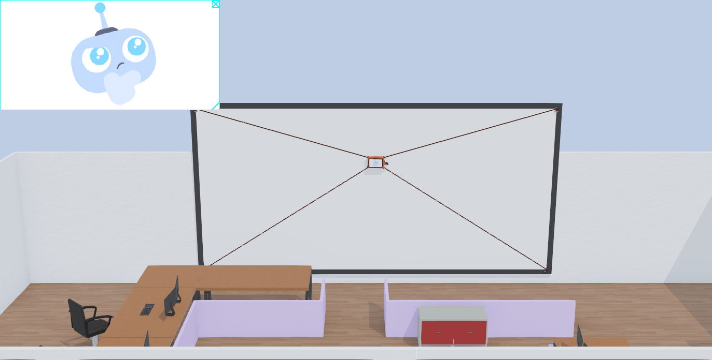
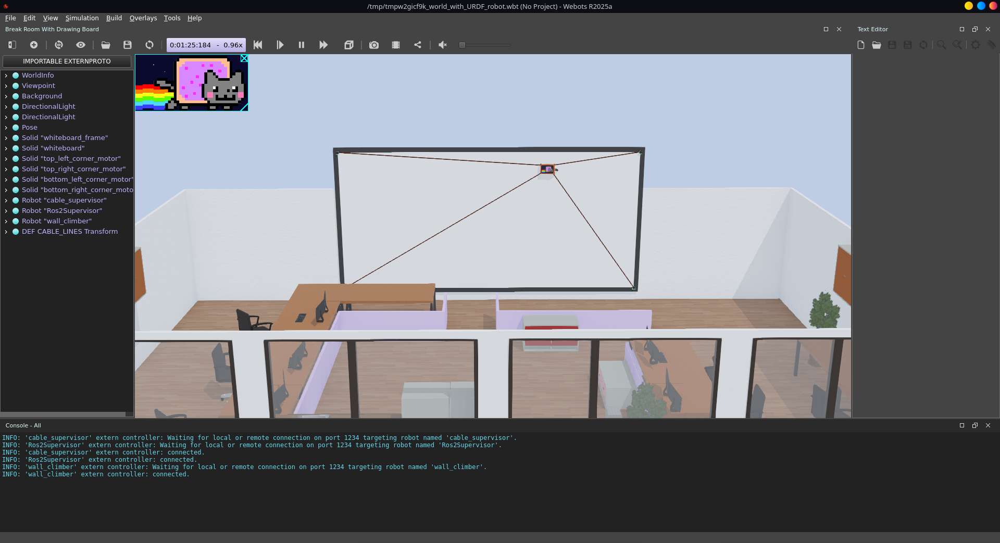
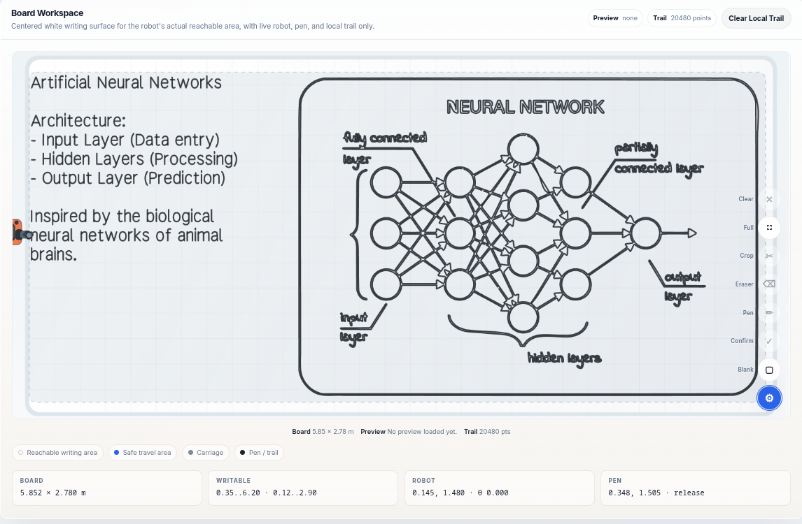
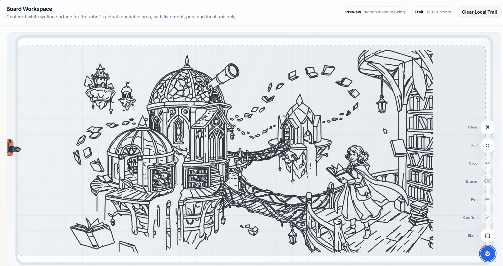
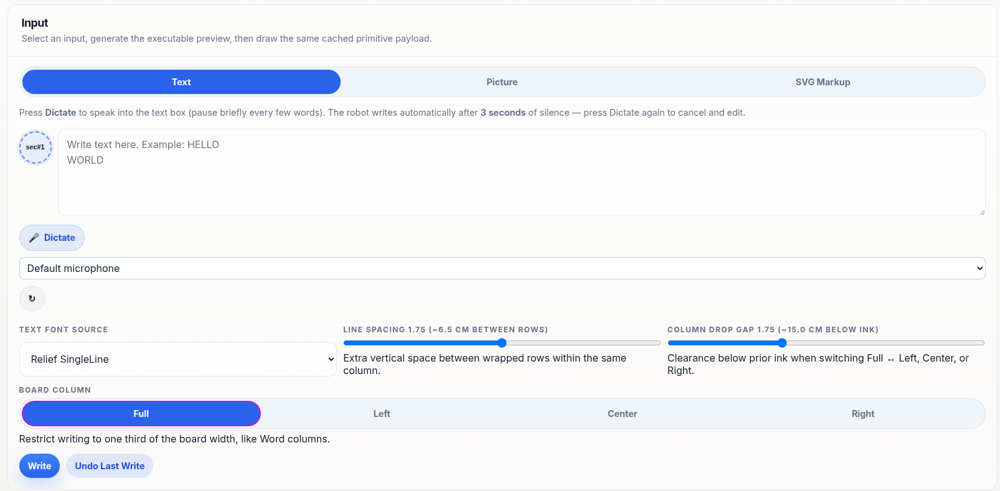
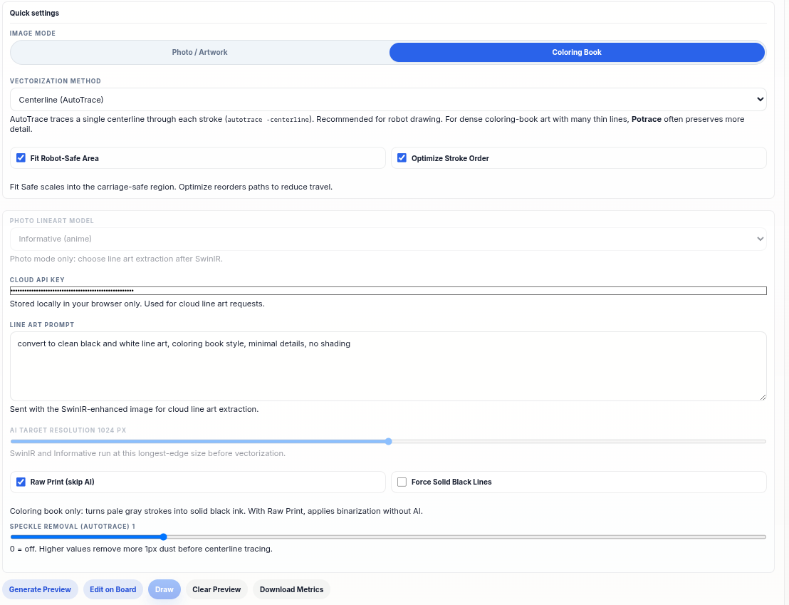
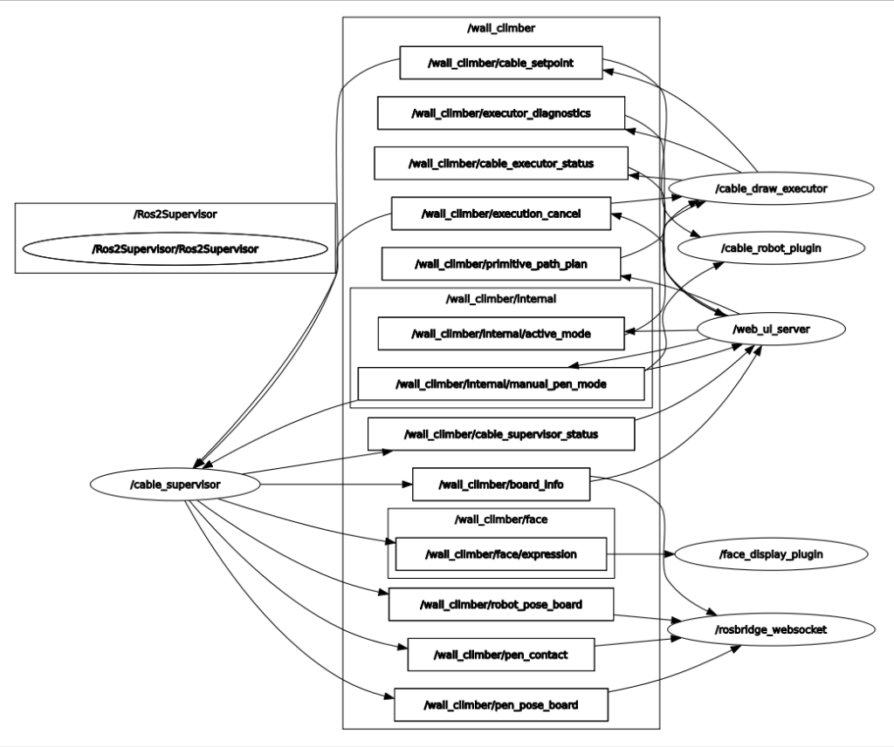

<p align="center">
  
</p>

<h1 align="center">Artie — Whiteboard Plotter</h1>

<p align="center">
  A cable-driven robot that draws on large whiteboards, powered by ROS 2 and Webots.
</p>

<p align="center">
  <a href="#features">Features</a> •
  <a href="#gallery">Gallery</a> •
  <a href="#quick-start">Quick Start</a> •
  <a href="#ai-models--dependencies">AI & Dependencies</a> •
  <a href="#architecture">Architecture</a>
</p>

---

## Features

- **Cable-Driven Kinematics** — Four-cable system with real-time workspace safety checks.
- **Image-to-Drawing Pipeline** — Upload a photo or sketch → AI preprocessing → vectorization → robot draws it.
- **Text Writing** — Type or dictate text; the robot writes it in single-line fonts with column layout support.
- **Voice Dictation** — Whisper-based speech-to-text; speak and the robot writes.
- **Live Web UI** — Browser-based control panel with real-time board preview, crop, erase, and draw tools.
- **Multiple Vectorizers** — AutoTrace (centerline) and Potrace (outline), selectable per job.
- **AI Line Art** — SwinIR upscaling + cloud/local line-art extraction for photos.
- **Webots Simulation** — Full 3D simulation with physics before deploying to hardware.

## Gallery

<p align="center">
  <br>
  <em>Webots 3D simulation — cable robot operating on the whiteboard with Nyan Cat animated on its OLED face screen</em>
</p>

<p align="center">
  <br>
  <em>Board workspace — text + diagram drawn by the robot</em>
</p>

<p align="center">
  <br>
  <em>Complex illustration — 32k+ points drawn autonomously</em>
</p>

<p align="center">
  <br>
  <em>Web UI — text input with voice dictation and column layout</em>
</p>

<p align="center">
  <br>
  <em>Web UI — image processing settings and vectorization controls</em>
</p>

## Quick Start

### Requirements

- Ubuntu 22.04 / ROS 2 Humble
- Webots R2025a+ (via `webots_ros2_driver`)
- Python 3.10+

### Build

```bash
source /opt/ros/humble/setup.bash
colcon build --packages-select wall_climber_interfaces wall_climber_draw_body wall_climber --symlink-install
```

### Run

```bash
ros2 launch wall_climber my_robot.launch.py
```

Open **http://localhost:8080** in your browser.

| Argument | Default | Description |
|---|---|---|
| `world` | `wall_world_basic.wbt` | Webots world file |
| `whisper_device` | `auto` | Whisper device: `auto`, `cuda`, `cpu` |

## AI Models & Dependencies

The project integrates several open-source AI and vectorization models. Installation & setup details:

- **Voice Dictation (Whisper & Silero VAD)**:
  Uses `faster-whisper` and `silero-vad`. Model weights (`base.en` by default) automatically download on first run.
  ```bash
  pip install faster-whisper silero-vad torch
  ```
- **AI Image Enhancements (SwinIR & Line Art)**:
  Super-resolution upscaling and line-art extraction powered by PyTorch models (`SwinIR` / `Informative-Drawings`). Models are loaded dynamically via PyTorch/OpenCV.
- **Centerline Vectorization (AutoTrace)**:
  Optional backend for single-stroke centerline tracing. Install via included script:
  ```bash
  scripts/install_autotrace.sh
  ```

## Architecture

<p align="center">
  <br>
  <em>ROS 2 Computation Graph — nodes, supervisors, topics, and web UI communication</em>
</p>

```
src/
├── wall_climber/              # Main Python package
│   ├── wall_climber/          # Robot logic, image pipeline, web server
│   ├── web/                   # Frontend (HTML/JS/CSS)
│   ├── config/                # YAML configuration
│   ├── urdf/                  # Robot URDF/Xacro models
│   └── worlds/                # Webots world files
├── wall_climber_interfaces/   # ROS 2 message definitions
└── wall_climber_draw_body/    # C++ cable draw executor
```

**Pipeline**: Upload/Dictate → AI Preprocess → Vectorize → Optimize stroke order → ROS transport → Cable executor → Drawing

## Tests

```bash
PYTHONPATH=src/wall_climber python3 -m pytest -q src/wall_climber/test -p no:anyio
```
